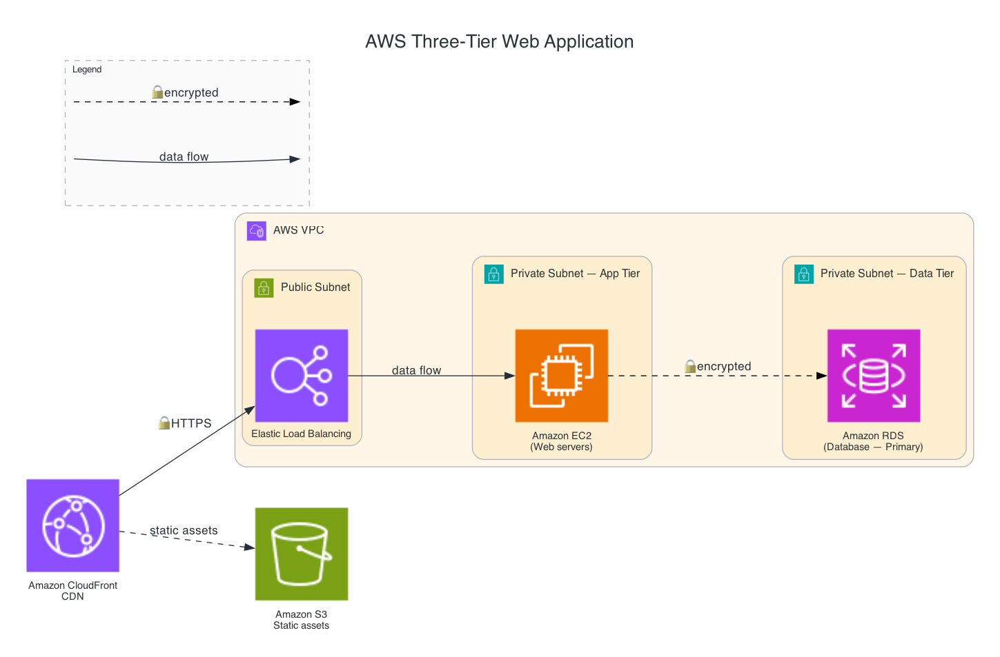
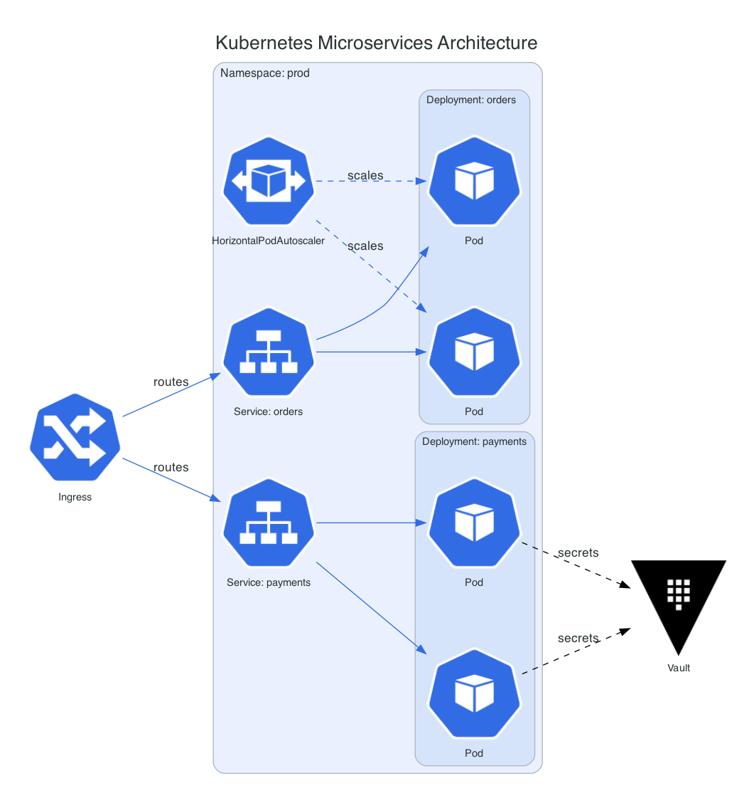
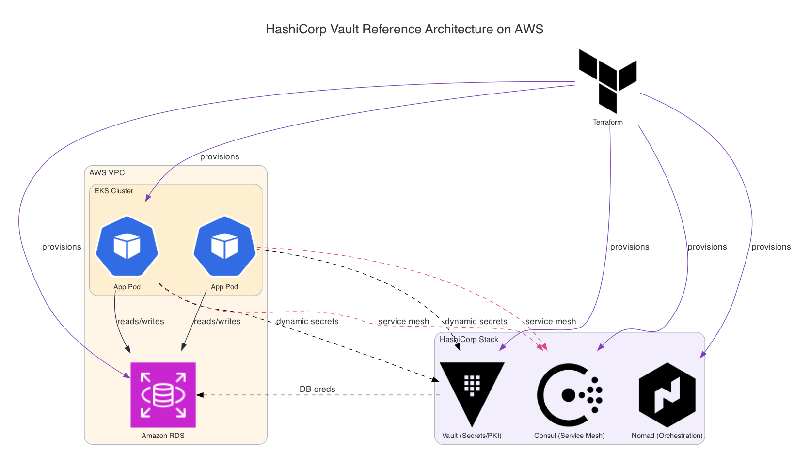

# cloud-diagrams

A Claude Code plugin that generates **Lucidchart-quality architecture diagrams** for AWS,
Azure, GCP, Kubernetes, DevOps/CI-CD, AI/ML, and HashiCorp (Terraform, Vault, Consul,
Nomad) — using each vendor's real, official icon set, not generic boxes.

| | |
|---|---|
|  |  |
|  | |

## How it works

Ask Claude Code to draw an architecture diagram — e.g. *"draw a 3-tier AWS web app"*,
*"diagram a Kubernetes microservices setup with Vault for secrets"*, *"show a Terraform +
Vault + Consul reference architecture"* — and this plugin's `cloud-diagram` skill writes
and runs a short Python script using the [`diagrams`](https://diagrams.mingrammer.com/)
library's graph/layout engine, rendering every node with this plugin's own bundled,
official icon assets (`assets/icons/`) rather than generic shapes. It also asks first, not
after: if something you didn't specify would meaningfully change the diagram — which cloud
provider, how many nodes in an HA cluster, high-level vs. detailed, which storage backend —
it asks rather than picking a default and hoping. See `SKILL.md`'s "Ask, don't assume"
section for the exact checklist.

Icon sourcing: `AWS Architecture Icons`, `Azure Architecture Icons`, and `Google Cloud
Icons` downloaded directly from each vendor's official page; the Kubernetes community icon
set; and CC0 icons from Simple Icons for HashiCorp tools, common DevOps tooling, and
AI/ML vendors. See [`NOTICE.md`](NOTICE.md) for exact sources and usage terms per icon.
AWS diagrams also get the small icon **badges** official AWS reference diagrams put next
to boundary labels (VPC, Public/Private Subnet, Region, Auto Scaling group) — not just
plain text — matching the convention you'd see in AWS's own architecture docs.

## Design principles

This isn't just "call a diagramming library and hope." A handful of real layout bugs
showed up building this plugin's own example diagrams, and the fixes are baked into
`references/style-guide.md` so they don't get rediscovered the hard way on every request:

- **Peer relationships get `constraint="false"`.** A directed edge between two equal nodes
  (e.g. Raft replication between HA cluster members) makes Graphviz rank one below the
  other by default, visually implying a parent/child hierarchy that isn't real.
- **Not every relationship gets a drawn arrow.** A "server owns its own storage" pairing
  repeated once per node adds arrow-count without adding information; if position/grouping
  already shows it, it doesn't need a line.
- **Sibling clusters don't reliably hold left-to-right order.** Peer groups that must stay
  in a specific sequence (e.g. 3 Availability Zones) go into one flat row of plain nodes
  instead of one `Cluster` each — tested, and cluster-level ordering is not reliable.
- **A legend is rendered separately and composited on**, autocropped, and placed on
  whichever side wastes the least canvas space — an in-graph legend cluster measurably
  distorts the real layout, and a naive "paste in the corner" can overlap real content.
- **The rendered image gets looked at, not just the exit code.** Layout bugs (crossing
  edges, floating labels, false hierarchy, legend overlap, dead white space) are only
  visible by looking — the skill checks for these before returning a result.

## Prerequisites

- Python 3
- [Graphviz](https://graphviz.org/) — provides the `dot` binary the `diagrams` library
  renders through:
  - macOS: `brew install graphviz`
  - Debian/Ubuntu: `sudo apt install graphviz`
  - Fedora/RHEL: `sudo dnf install graphviz`
- Python packages: `pip3 install diagrams Pillow` (`Pillow` is used for the legend
  compositing step described above)

The skill runs `scripts/check_env.py` automatically and tells you exactly what's missing
if any dependency isn't set up.

## Install

```
/plugin marketplace add <this-repo-url-or-path>
/plugin install cloud-diagrams@cloud-diagrams-marketplace
```

## Example prompts

- "Draw a 3-tier AWS web application with a load balancer, EC2, and RDS"
- "Diagram a Kubernetes microservices setup with an ingress, two services, and Vault for secrets"
- "Show a HashiCorp reference architecture: Terraform provisioning AWS infra, Vault for secrets, Consul for service mesh"
- "Draw an Azure architecture with App Service, Azure SQL, and Key Vault"
- "Diagram a RAG pipeline using Bedrock and a vector database"

## Repo layout

```
skills/cloud-diagram/SKILL.md              requirements-gathering, icon lookup, self-correction logic
skills/cloud-diagram/references/           7 domain icon catalogs (aws/azure/gcp/kubernetes/
                                            devops/hashicorp/ai-ml.md) + aws-boundaries.md and
                                            kubernetes-boundaries.md (cluster-label badge icons)
                                            + style-guide.md (all the layout/rendering conventions)
commands/cloud-diagram.md                  explicit /cloud-diagram entry point
scripts/check_env.py                       runtime dependency check (diagrams, Pillow, Graphviz)
scripts/build_icon_catalog.py              authoring-time only: rebuilds assets/icons/ + references/*.md
                                            from freshly-downloaded vendor icon packs
assets/icons/<provider>/                   the bundled, curated node icon library (see NOTICE.md)
assets/icons/{aws,kubernetes}/boundaries/  small badge icons for cluster/boundary labels
examples/                                  sample rendered diagrams
```

## Refreshing the icon set

Vendor icon packs update periodically (AWS roughly quarterly). To refresh: download the
latest packs from the official sources listed in `NOTICE.md`, extract them into a staging
directory, and re-run:

```
python3 scripts/build_icon_catalog.py --staging /path/to/staging
```

## License

This repo's code is MIT licensed (see `LICENSE`). Bundled icon assets carry their own
vendor terms — see `NOTICE.md` before redistributing this repo further.
